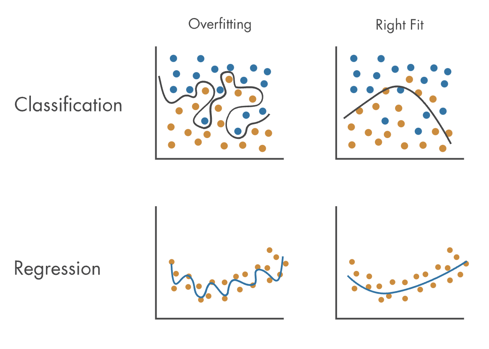
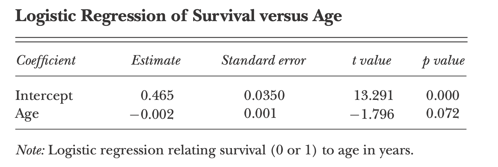
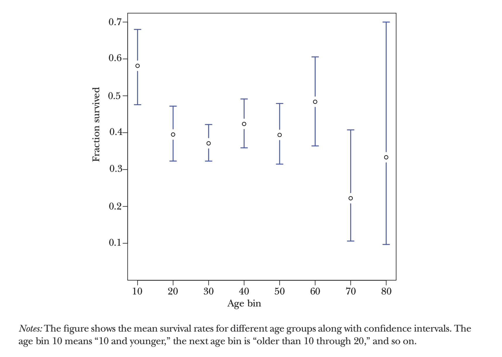
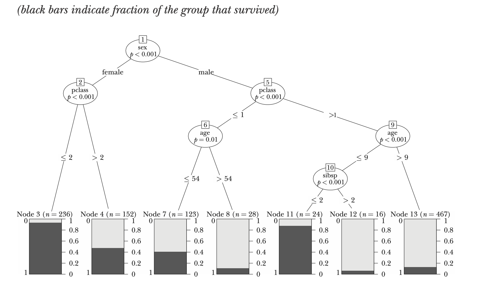
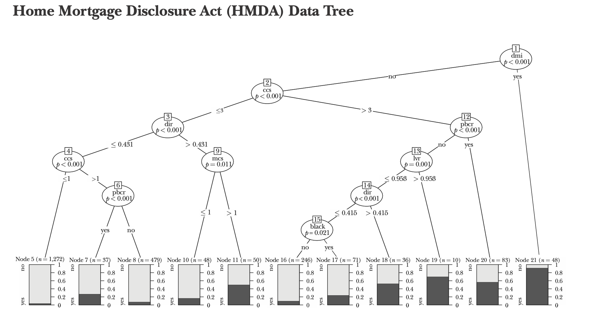

# Summary of [Big Data: New Tricks for Econometrics](https://www.aeaweb.org/articles?id=10.1257/jep.28.2.3) (Hal R. Varian)
* Prepared by **Harshit Goyal (2021MT10143)**

## Some terms:
* $x$ is also called $\text{predictor or feature or explanatory variables}$ in this paper.
* $\text{Overfitting/ High Variance  }$ : The model picks up noise in the data, performs well on the Traning Data for poor generalisation. 

|  | 
|:--:| 
|Overfitting and Underfitting |

***

## General Considerations for Prediction
* Our goal is to get good $\text{out-of-sample}$ predictions i.e. the model $generalises$ well or simply, it makes $good$ predictions on unseen examples.  
* One example: $n$ linearly independent $regressors$ will fit $n$ observations perfectly but will usually have poor $\text{out-of-sample}$ performance. $n$ Linearly Independent equations in $n$ variables (the regression coefficients here)

***

### Solving Overfitting
1) $\text{Regularization}$: Penalize models for excessive complexity as $simpler$ models tend to work better for $\text{out-of-sample}$ forecasts.
2) An $explicit$  numeric  measure  of  model  complexity: Hyperparametrs. For example, the degree of the polynomial you want to fit your data into. 
3) Splitting the dataset into $\text{Training, Validation and Testing}$. Use the $\text{training}$ data to estimate a model, the $\text{validation data}$ to choose your model, and the $\text{testing data}$ to evaluate how well your chosen model performs. (Often $\text{validation}$ and $\text{testing}$ sets are combined.)

### Tuning the model: $\text{k-fold-cross-validation}$

***

### Algorithm:
1) Divide  the  data  into  $k$  roughly  equal  subsets  (folds)  and  label  them  by  
$s = 1, ... , k$. Start with subset $s = 1$.
2) Pick a value for the tuning parameter.
3) Fit your model using the $k − 1$ subsets other than subset $s$.
4) Predict for subset $s$ and measure the associated loss.
5) Stop if $s = k$, otherwise increment $s$ by $1$ and go to step $2$
***

* Notice: We test on the fold, we didn't use for training so it'll give us an idea of $\text{out-of-sample}$ performance. Even if there is no $\text{tuning parameter}$, it is prudent to use cross-validation to report $\text{goodness-of-fit}$.
* Common choices for $k$ are $10$, $5$, and $\text{Sample Size}$ or $\text{“leave one out”}$.
* Another usecase: When dataset is small and you don't want to split it into  $\text{Training}$, $\text{Validation}$ and $\text{Testing}$ and $waste$ it. 
* For  many  years,  economists  have  reported  $\text{in-sample goodness-of-fit}$  measures  using  the  excuse  that  we  had  $small$  datasets. But now larger datasets have become available so it's good to split the dataset. 

***
 
 
 
 

## Classification and Regression Trees

* Economists would typically use a generalized linear model like a $logit$ or $probit$ for a classification problem but these can draw only Linear decision boundary! We want to build a $\text{non-linear classfier}$. 
* Trees tend to work well for problems where there are important nonlinearities and interactions.

|  ||
|:--:| :--:|
|Decision Tree | Partition Plot| 

* Above tree is constructed using just $2$ features $age$ and $class$ of travel.
* The Class $lived$ or $died$ mentioned on the $leaves$ is the majority class.  
* Let's see how to interpret it and make a prediction:
    - $\text{age: 34 , class: 1}  \to \text{predicted-outcome: lived}$
* $Tranining$ $Accuracy$: $\frac{723}{1046} = 69.12$%
* The paper mentions "The rules fits the data reasonably well, misclassifying about $30$ percent of the observations in the testing set"

***
 
 
 
 
 
 

## Decision Tree vs Logistic Regression
* By constructing a $tree$ relating $survival$ to $age$ the rule generated is $\text{"survive if age} < 8.5 \text{ year"}$ while $\text{Logistic Regression}$ produces:

|  |
|:--:| 
|Logistic Regression of Survival versus Age|

* $\text{Logistic model}$ says $age$ is barely important.

* This is resolved as: 
* In the below diagram, Survival rates for the youngest passengers were relatively high, and survival rates for older passengers were relatively low. So what mattered for survival is not so much age, but whether the passenger was a child or elderly. It would be diffificult to discover this pattern from a logistic regression alone.

|  |
|:--:| 
|Titanic Survival Rates by Age Group|

* $Trees$ also handle missing data well.
* $\text{Perlich, Provost, and Simonoff (2003)}$ examined several standard datasets and found that $\text{“logistic regression is better for smaller data sets and tree induction for larger data sets.”}$

## Pruning
* We can keep branching the $tree$ further and get better $\text{Training Accuracy}$ but this will simply $overfit$.
* Solution to $\text{overfitting}$ is to add $\text{cost  to complexity}$ 
* One measure for complexity in a tree: the number of $\text{leaves}$ and other is the  $\text{depth}$ of the tree
* Typically chosen using $1\text{0-fold-cross-validation}$.
* "Some researchers recommend being a bit more aggressive and advocate choosing the complexity parameter that is one standard deviation lower than the loss-minimizing value."

***
## Statistical Method: Conditional Inference tree - $ctree$
* $ctree$ chooses the structure of the tree using a sequence of hypothesis tests
* The resulting trees tend to need very little pruning (Hothorn, Hornik, and Zeileis 2006)

|  |
|:--:| 
|Conditional Inference Tree| 

* $subsp$: number of siblings plus spouse aboard.
* One might summarize this tree by the following principle: “women
and children first . . . particularly if they were traveling first . .  class"

***
## An Economic Example Using Home Mortgage Disclosure Act Data
* Question: $\text{"If race played a significant role in determining who was approved for a mortgage?"}$
### Logistic Regression:
* Result of logistic regression: The coefficient of race showed a $\text{statistically significantly}$ negative impact on probability of getting a mortgage for black applicants that later prompted considerable debate and discussion.

***
### Ctree:
* $2,380$  observations of $12$  predictors , used $R$ package $party$.

|Model|# of misclasified examples|Error rate|
|:--:|:--:|:--:|
|Logistic Regression|$228$|$9.6$%|
|ctree|$225$|$9.5$%|

|  |
|:--:| 
|Conditional Inference Tree for House Mortage data|

* $dmi = \text{denied mortgage insurance}$: this variable alone explains much of the variation in the data. See the figure
* The race variable (“black”) shows up far down the tree
* So how to infer if $race$ is decisive?
* When this $race$ is not used as a feature to construct the $ctree$, accuracy doesn’t change at all. 
* But it's possible that there is $racial$ discrimination  elsewhere in the mortgage process, or that some of the variables included are highly correlated with race.

***
 
 

## Boosting Bagging Bootstrap
* Adding randomness turns out to be a helpful way of dealing with the overfitting  problem.

* $\text{Bootstrap}$: Choosing (with replacement) a sample of size $n$ from a dataset to estimate the sampling distribution of some statistic. A variation is $m$ out of $n$ bootstrap $(n > m)$.
* $\text{Bagging}$: Averaging across models estimated with several different bootstrap samples in order to improve the performance of an estimator.
* $\text{Boosting}$: Repeated estimation where misclassified observations are given increasing weight in each repetition. The final estimate is then a vote or an average across the repeated estimates.

* Econometricians are well-acquainted with the bootstrap but rarely use the other two methods

***
## Random Forests
***
### Algorithm
1. Choose a $bootstrap$ sample of the observations and start to grow a tree.
2. At each node of the tree, choose a random sample of the predictors to make 
the next decision. Do not prune the trees.
3. Repeat this process many times to grow a forest of trees.
4. In order to determine the classification of a new observation, have each tree 
make a classification and use a majority vote for the final prediction
***

* This method produces surprisingly good out-of-sample fits, particularly with 
highly nonlinear data.
* Howard and Bowles (2012) claim “ensembles of 
decision trees (often known as ‘Random Forests’) have been the most successful 
general-purpose algorithm in modern times.

* There are 
a number of variations and extensions of the basic “ensemble of trees” model such 
as Friedman’s “Stochastic Gradient Boosting” (Friedman 2002)

### To replicate the experiments: 
* The $\text{datasets}$ and $\text{R}$ code of Author can be found [here](https://www.openicpsr.org/openicpsr/project/113925/version/V1/view).
* Build [Decision Trees](https://scikit-learn.org/stable/modules/tree.html) and [Random Forests](https://scikit-learn.org/stable/modules/generated/sklearn.ensemble.RandomForestClassifier.html). 

# References
### Images:
* *Overfitting and Underfitting* : https://in.mathworks.com/discovery/overfitting.html
* All other images taken from [Big Data: New Tricks for Econometrics](https://www.aeaweb.org/articles?id=10.1257/jep.28.2.3)
