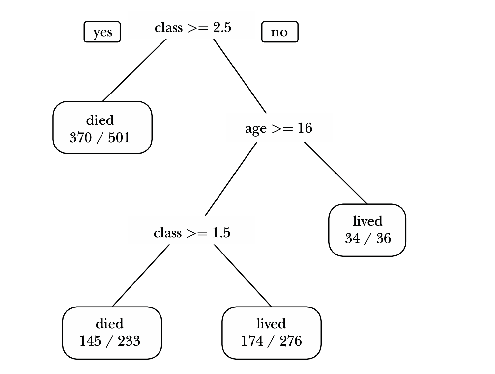
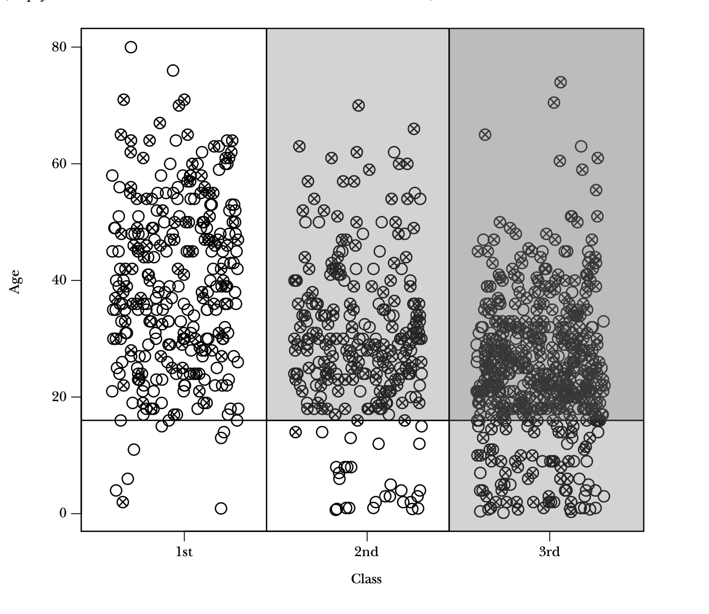

# [Big Data: New Tricks for Econometrics](https://www.aeaweb.org/articles?id=10.1257/jep.28.2.3)

## Some terms:
* $x$ is also called $predictor$ or  $feature$ or $explanatory$ $variables$
* $Overfitting / \text{ }  High \text{ } Variance$: The model picks up noise in the data, performs well on the Traning Data for poor generalisation.

* $Underfitting / \text{ }  High \text{ }  Bias$: The model is too simple unable to capture patters in the data. 
* $Hyperparametrs$: They specify details of the learning process. They are chosen for traning and not $learnt$, in contrast to $parameters$. For example the $learning  \text{ } rate$ in Gradient Descent, the $C$ in Soft Margin SVM's etc.

|  | 
|:--:| 
| *Overfitting and Underfitting* |

## General Considerations for Prediction
* Our goal is to get good $out-of-sample$ predictions i.e. the model $generalises$ well or simply, it makes $good$ predictions on unseen examples.  
* $n$ linearly independent regressors will fit $n$ observations perfectly but but will usually have poor $out-of-sample$ performance. 
### Solving Overfitting
1) $Regularization$: Penalize models for excessive complexity as $simpler$ models tend to work better for $out-of-sample$ forecasts.
2) Splitting the dataset into $Training$, $Validation$ and $Testing$ 
3) An $explicit$  numeric  measure  of  model  complexity: Hyperparametrs. For example, the degree of the polynomial you want to fit your data into. 

### Tuning the model: $k-fold-cross-validation$
***
#### Algorithm:
1) Divide  the  data  into  $k$  roughly  equal  subsets  (folds)  and  label  them  by  
$s = 1, ... , k$. Start with subset $s = 1$.
2) Pick a value for the tuning parameter.
3) Fit your model using the $k − 1$ subsets other than subset $s$.
4) Predict for subset $s$ and measure the associated loss.
5) Stop if $s = k$, otherwise increment $s$ by $1$ and go to step $2$
***

* Notice: We test on the fold, we didn't use for training so it'll give us an idea of $out-of-sample$ performance. Even if there is no $tuning \text{ } parameter$, it is prudent to use cross-validation to report $goodness-of-fit$.
* Common choices for $k$ are $10$, $5$, and $SampleSize - 1$ or $“leave \text{ } one \text{ } out”$.
* Another usecase: When dataset is small and you don't want to split it into  $Training$, $Validation$ and $Testing$ and $waste$ it. 
* For  many  years,  economists  have  reported  $in-sample$  $goodness-of-fit$  measures  using  the  excuse  that  we  had  $small$  datasets. But now now larger datasets have become available so it'sgood to split the dataset. 

## Classification and Regression Trees

* Economists would typically use a generalized linear model like a $logit$ or $probit$ for a classification problem but these can draw only Linear decision boundary! We want to buikd a non-linear classfier 
* Trees tend to work well for problems where there are important nonlinearities and interactions.

|  | 
|:--:| 
| Classification tree for survivors of the $Titanic$ |

* The Class $lived$ or $died$ mentioned on the $leaves$ is the majority class.  
* Let's see how to interpret it and make a prediction:
* $Tranining$ $Accuracy$: $\frac{723}{1046} = 69.12$%
* The paper mentions "The rules fits the data reasonably well, misclassifying about $30$ percent of the observations in the testing set"

## Partition Plot 

|  ||
|:--:| :--:|
|Decision Tree | Partition Plot| 

# References
Images:
*Overfitting and Underfitting* : https://in.mathworks.com/discovery/overfitting.html

What is probit?

* Slight detail about regression trees: grow till THRESHOLD variamce, report the mean 
* If the values of all features is same but the results of the 2 datas are different: It won't be possible to get 100% accuracy there. 
Forget what these number are, just look at "alive" or "dead"

