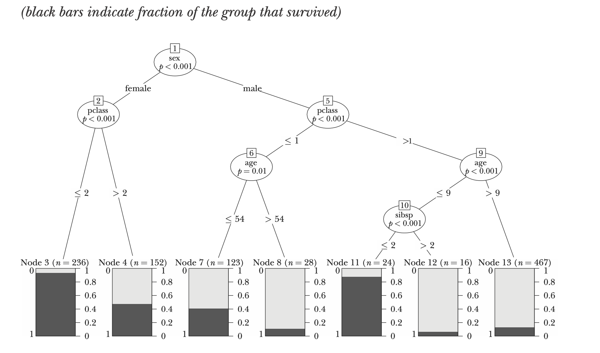

# [Big Data: New Tricks for Econometrics](https://www.aeaweb.org/articles?id=10.1257/jep.28.2.3)

## Some terms:
* $x$ is also called $\text{predictor or feature or explanatory variables}$
* $\text{Overfitting/ High Variance  }$ : The model picks up noise in the data, performs well on the Traning Data for poor generalisation.

* $ \text{Underfitting /  High Bias}$ : The model is too simple unable to capture patters in the data. 
* $\text{Hyperparametrs}$ : They specify details of the learning process. They are chosen for traning and not $learnt$, in contrast to $parameters$. For example the $learning  \text{ } rate$ in Gradient Descent, the $C$ in Soft Margin SVM's etc.

|  | 
|:--:| 
|Overfitting and Underfitting |

## General Considerations for Prediction
* Our goal is to get good $\text{out-of-sample}$ predictions i.e. the model $generalises$ well or simply, it makes $good$ predictions on unseen examples.  
* $n$ linearly independent regressors will fit $n$ observations perfectly but will usually have poor $\text{out-of-sample}$ performance. 
### Solving Overfitting
1) $\text{Regularization}$: Penalize models for excessive complexity as $simpler$ models tend to work better for $\text{out-of-sample}$ forecasts.
2) Splitting the dataset into $\text{Training, Validation and Testing}$ 
3) An $explicit$  numeric  measure  of  model  complexity: Hyperparametrs. For example, the degree of the polynomial you want to fit your data into. 

### Tuning the model: $\text{k-fold-cross-validation}$
***
### Algorithm:
1) Divide  the  data  into  $k$  roughly  equal  subsets  (folds)  and  label  them  by  
$s = 1, ... , k$. Start with subset $s = 1$.
2) Pick a value for the tuning parameter.
3) Fit your model using the $k − 1$ subsets other than subset $s$.
4) Predict for subset $s$ and measure the associated loss.
5) Stop if $s = k$, otherwise increment $s$ by $1$ and go to step $2$
***

* Notice: We test on the fold, we didn't use for training so it'll give us an idea of $\text{out-of-sample}$ performance. Even if there is no $\text{tuning parameter}$, it is prudent to use cross-validation to report $\text{goodness-of-fit}$.
* Common choices for $k$ are $10$, $5$, and $\text{Sample Size - 1}$ or $“leave \text{ } one \text{ } out”$.
* Another usecase: When dataset is small and you don't want to split it into  $\text{Training}$, $\text{Validation}$ and $\text{Testing}$ and $waste$ it. 
* For  many  years,  economists  have  reported  $\text{in-sample goodness-of-fit}$  measures  using  the  excuse  that  we  had  $small$  datasets. But now now larger datasets have become available so it's good to split the dataset. 

## Classification and Regression Trees

* Economists would typically use a generalized linear model like a $logit$ or $probit$ for a classification problem but these can draw only Linear decision boundary! We want to buikd a $\text{non-linear classfier}$. 
* Trees tend to work well for problems where there are important nonlinearities and interactions.

|  | 
|:--:| 
| Classification tree for survivors of the $Titanic$ |

* The Class $lived$ or $died$ mentioned on the $leaves$ is the majority class.  
* Let's see how to interpret it and make a prediction:
* $Tranining$ $Accuracy$: $\frac{723}{1046} = 69.12$%
* The paper mentions "The rules fits the data reasonably well, misclassifying about $30$ percent of the observations in the testing set"

## Partition Plot 

|  ||
|:--:| :--:|
|Decision Tree | Partition Plot| 

## Pruning
* Solution to $\text{overfitting}$ is to add $\text{cost  to complexity}$ 
* One measure for complexity in a tree: the number of $\text{leaves}$ and other is the  $\text{depth}$ of the tree
* Typically chosen using $1\text{0-fold-cross-validation}$.
* "Some researchers recommend being a bit more aggressive and advocate choosing the complexity parameter that is one standard 

## Statistical Method: Conditional Inference tree - $ctree$
* $ctree$ chooses the structure of the tree using a sequence of hypothesis tests
* The resulting trees tend to need very little pruning (Hothorn, Hornik, and Zeileis 2006)

|  |
|:--:| 
|Conditional Inference Tree| 

* $subsp$: number of siblings plus spouse aboard.
* One might summarize this tree by the following principle: “women
and children first . . . particularly if they were traveling first . .  class"

## An Economic Example Using Home Mortgage Disclosure Act Data
* Question: If race played a significant role in determining who was approved for a mortgage?
## Logistic Regression:
* Result of logistic regression: The coefficient on race showed a statistically significantly negative impact on probability of getting a mortgage for black applicants that later prompted considerable subsequent debate and discussion.

## Ctree:
* $2,380$  observations of $12$  predictors , used $R$ package $party$.

|Model|# of misclasified examples|Error rate|
|:--:|:--:|:--:|
|Logistic Regression|$228$|$9.6$%|
|ctree|$225$|$9.5$%|

* $dmi = \text{denied mortgage insurance}$: this variable alone explains much of the variation in the data. 
* The race variable (“black”) shows up far down the tree
* So how to infer if $race$ is decisive?
* When this $race$ is not used as a feature to construct the $ctree$, accuracy doesn’t change at all: 
* But it's possible that there is $racial$ discrimination  elsewhere in the mortgage process, or that some of the variables included are highly correlated with race.

## Boosting Bagging Bootstrap
* Adding randomness turns out to be a helpful way of dealing with the overfiiing  problem.

* $\text{Bootstrap}$: Choosing (with replacement) a sample of size involves choosing (with replacement) a sample of size $n$ from a dataset from a dataset to estimate the sampling distribution of some statistic. A variation is $m$ out of $n$ bootstrap $(n > m$)$.
* $\text{Bagging}$: Averaging across models estimated with several different bootstrap samples in order to improve the performance of an estimator.
* $\text{Boosting}$: Repeated estimation where misclassified observations are given increasing weight in each repetition. The final estimate is then a vote or an average across the repeated estimates.

* Econometricians are well-acquainted with the bootstrap but rarely use the other two methods
## Randon Forests

* This method produces surprisingly good out-of-sample fits, particularly with 
highly nonlinear data.
* Howard and Bowles (2012) claim “ensembles of 
decision trees (often known as ‘Random Forests’) have been the most successful 
general-purpose algorithm in modern times.

* There are 
a number of variations and extensions of the basic “ensemble of trees” model such 
as Friedman’s “Stochastic Gradient Boosting” (Friedman 2002)

they don’t
offer simp

# References
Images:
*Overfitting and Underfitting* : https://in.mathworks.com/discovery/overfitting.html

What is probit?

* Slight detail about regression trees: grow till THRESHOLD variamce, report the mean 
* If the values of all features is same but the results of the 2 datas are different: It won't be possible to get 100% accuracy there. 
Forget what these number are, just look at "alive" or "dead"
